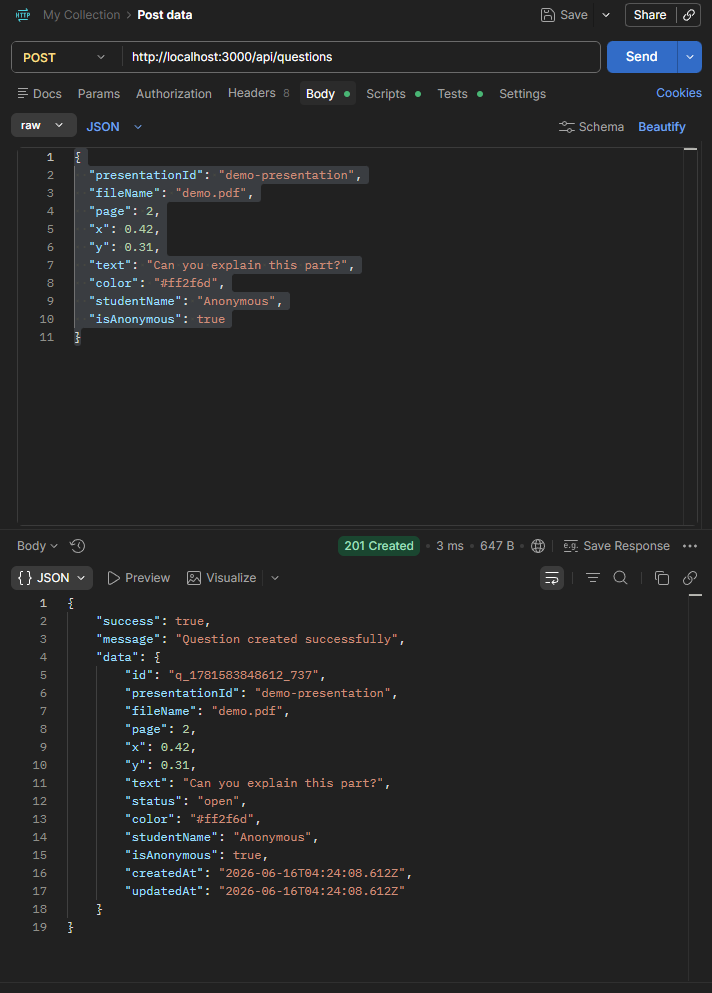
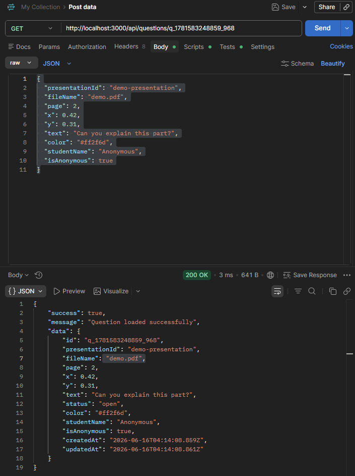
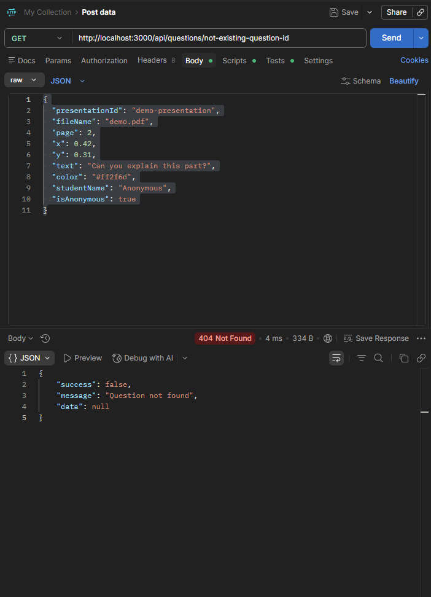
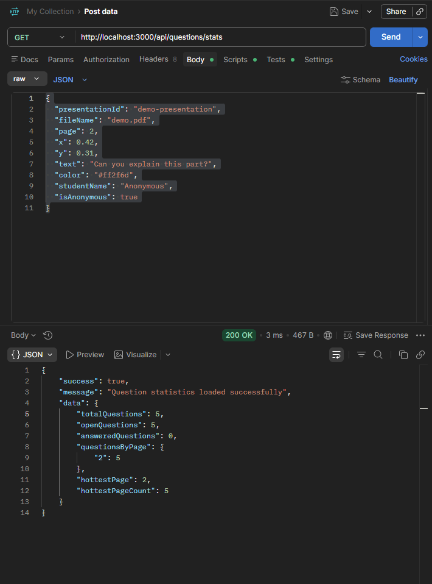
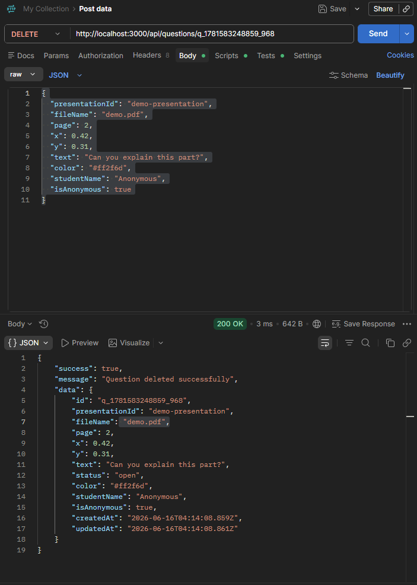
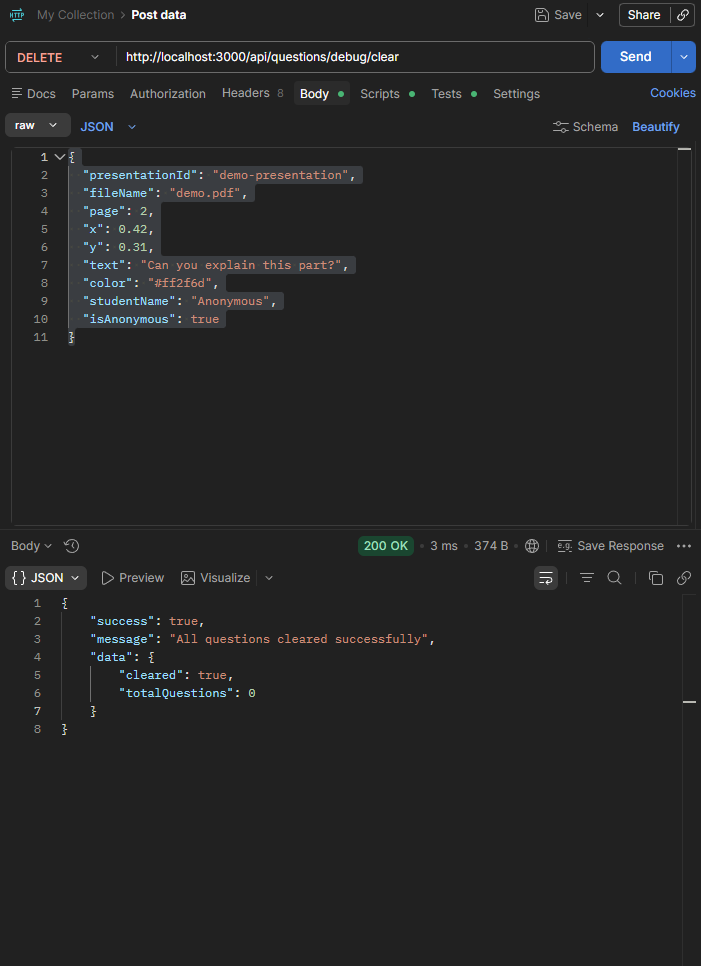

<p align="center">
  
</p>

<h1 align="center">🖊️ DLS Backend — Dynamic Lecture System Server 👨🏻‍🏫</h1>

<p align="center">
  Backend prototype for the <b>Dynamic Lecture System</b> project.
</p>

<p align="center">
  Built with <b>Node.js</b>, <b>Express</b>, <b>REST API</b>, <b>Postman</b> and prepared for <b>Socket.IO</b>.
</p>

<p align="center">
  
  
  
  
  
</p>


---

## 📌 Overview

This repository contains the backend server for the **Dynamic Lecture System**, also called **DLS**.

|<a align="center" href="https://www.figma.com/design/9i2kHP9lS4gbiZunjcRXXg/DLS---Dynamic-Lecture-System?node-id=0-1&p=f&t=apUaMVJGVwu2voGb-0">

</a> &nbsp; | &nbsp;
<a href="https://github.com/users/DorManDel/projects/2/views/2">
  
</a>|

The server provides REST API routes for:

* Users
* Lecture questions
* Question position data
* Question statistics
* Dashboard and summary data

At this stage, the backend is a **proof-of-concept**.
It uses temporary in-memory storage and is prepared for future database and realtime integration.

---

<details>
<summary><b>🎯 Project Goal</b></summary>

<br>

The backend should support the DLS lecture system with:

* User registration/login foundation
* Question creation during a lecture
* Question position saving on a PDF page
* Question statistics for dashboard, summary and heatmap
* Clean REST API structure
* Future realtime updates with Socket.IO
* Future database connection

</details>

---

<details>
<summary><b>🧰 Tech Stack</b></summary>

<br>

| Tool      | Purpose                                 |
| --------- | --------------------------------------- |
| Node.js   | JavaScript runtime for the server       |
| Express   | REST API server                         |
| CORS      | Allows frontend/backend communication   |
| Dotenv    | Loads environment variables from `.env` |
| Nodemon   | Development auto-restart                |
| Postman   | API testing                             |
| Socket.IO | Future realtime updates                 |

</details>


---

<details open>
<summary><b>🏗️ Architecture Idea</b></summary>

<br>

The backend is split into small layers:

```txt
[1] Client / Postman / Frontend
        ↓
[2] Route
        ↓
[3] Controller
        ↓
[4] Store
        ↓
[5] JSON Response
```

### Route

Defines the API address.

Example:

```txt
POST /api/questions
```

### Controller

Handles the HTTP request and response.

It decides:

```txt
Is the request valid?
Which store function should run?
Which HTTP status code should return?
```

### Store

Handles data logic.

It decides:

```txt
How to create data?
How to find data?
How to update data?
How to delete data?
```

Important:

```txt
Store does not use req/res.
Store does not return HTTP status codes.
Controller handles HTTP.
```

</details>

---

<details open>
<summary><b>▶️ Run Locally</b></summary>

<br>

Install dependencies:

```bash
npm install
```

Run development server:

```bash
npm run dev
```

Run production-style server:

```bash
npm start
```

Default local server:

```txt
http://localhost:3000
```

</details>

---

<details>
<summary><b>🔐 Environment Variables</b></summary>

<br>

Create a `.env` file locally:

```env
PORT=3000
NODE_ENV=development
```

The real `.env` file should not be uploaded to GitHub.

Use `.env.example` as the public example file.

</details>

---

<details>
<summary><b>💓 Health Check</b></summary>

<br>

### Request

```http
GET /api/health
```

### Response

```json
{
  "success": true,
  "message": "DLS server is running",
  "data": {
    "port": 3000,
    "environment": "development"
  }
}
```

</details>

---

<details open>
<summary><b>📡 API Summary</b></summary>

<br>

| Method | Endpoint | Description |
| ------ | -------- | ----------- |
| GET | `/api/health` | Server health check |
| POST | `/api/users` | Create user |
| GET | `/api/users` | Get all users |
| POST | `/api/questions` | Create question |
| GET | `/api/questions` | Get questions |
| GET | `/api/questions/stats` | Get question statistics |


</details>

---

<details>
<summary><b>👤 Users API</b></summary>

<br>

### Create User

```http
POST /api/users
```

Body:

```json
{
  "username": "Dor",
  "password": "123456"
}
```

Success:

```txt
201 Created
```

---

### Get All Users

```http
GET /api/users
```

Success:

```txt
200 OK
```

</details>

---

<details open>
<summary><b>❓ Questions API</b></summary>

<br>

### Create Question

```http
POST /api/questions
```

Body:

```json
{
  "presentationId": "demo-presentation",
  "fileName": "demo.pdf",
  "page": 2,
  "x": 0.42,
  "y": 0.31,
  "text": "Can you explain this part?",
  "color": "#ff2f6d",
  "studentName": "Anonymous",
  "isAnonymous": true
}
```

Success:

```txt
201 Created
```

---

### Get All Questions

```http
GET /api/questions
```

Success:

```txt
200 OK
```

Optional filters:

```txt
GET /api/questions?presentationId=demo-presentation
GET /api/questions?page=2
GET /api/questions?status=open
GET /api/questions?search=explain
```

---

### Get Question By ID

```http
GET /api/questions/:id
```

Example:

```txt
GET /api/questions/q_1781580697680_911
```

Success:

```txt
200 OK
```

If the question does not exist:

```txt
404 Not Found
```

---

### Update Question

```http
PUT /api/questions/:id
```

Body example:

```json
{
  "text": "Updated question text",
  "status": "answered"
}
```

Success:

```txt
200 OK
```

---

### Delete Question

```http
DELETE /api/questions/:id
```

Success:

```txt
200 OK
```

---

### Question Statistics

```http
GET /api/questions/stats
```

Response example:

```json
{
  "success": true,
  "message": "Question statistics loaded successfully",
  "data": {
    "totalQuestions": 1,
    "openQuestions": 1,
    "answeredQuestions": 0,
    "questionsByPage": {
      "2": 1
    },
    "hottestPage": 2,
    "hottestPageCount": 1
  }
}
```

---

### Debug Clear Questions

Development-only route:

```http
DELETE /api/questions/debug/clear
```

Purpose:

```txt
Clear all in-memory questions while testing with Postman.
```

Success:

```txt
200 OK
```

</details>

---

<details>
<summary><b>🧪 Postman Tests</b></summary>

<br>

The API was tested with Postman.

### Create Question [❔/➕]



### Get Question By ID [❔/🆔]



### Question Not Found [❔/🚫]



### Question Statistics [❔/📊]



### Delete Question [❔/❌]



### Debug Clear Questions [❔/🧼]



</details>

---

<details>
<summary><b>💾 Current Data Storage</b></summary>

<br>

At this stage, the project uses temporary in-memory storage.

That means:

```txt
Data exists while the server is running.
Data is deleted when the server restarts.
```

Current storage files:

```txt
src/data/users.store.js
src/data/questions.store.js
```

Later, this layer can be replaced with a real database without changing the entire project structure.

</details>

---

<details>
<summary><b>📡 HTTP Response Guide</b></summary>

<br>

More details about status codes are documented here:

```txt
docs/HTTP_RESPONSES.md
```

Common status codes:

| Status | Meaning      | Used When                      |
| -----: | ------------ | ------------------------------ |
|  `200` | OK           | Request succeeded              |
|  `201` | Created      | New resource created           |
|  `400` | Bad Request  | Missing or invalid client data |
|  `404` | Not Found    | Resource does not exist        |
|  `409` | Conflict     | Duplicate or conflicting data  |
|  `500` | Server Error | Unexpected server problem      |

</details>

---

<details>
<summary><b>📡 Realtime Events</b></summary>

| Event | Direction | Description |
| ----- | --------- | ----------- |
| `presentation:join` | Client -> Server | Join Presentation Room |
| `question:created` | Server -> Client | New Question was created |
| `question:updated` | Server -> Client | Question was updated |
| `question:deleted` | Server -> Client | Question was deleted |

</details>

---

<details open>
<summary><b>👨🏻‍💻 Dev Installers 📦</b></summary>

## ⚙️ Install Project Requirements

Run this command from the project root folder:

### Windows PowerShell

```powershell
node -v; npm -v; npm install express cors dotenv socket.io; npm install nodemon --save-dev
```

### WSL / Linux / Git Bash
```bash
node -v && npm -v && npm install express cors dotenv socket.io && npm install nodemon --save-dev
```

### Run the Server 🏃🏻‍♂️
```bash
npm run dev
```

### Optional: Install Postman 📬

```powershell
winget install -e --id Postman.Postman --accept-package-agreements --accept-source-agreements
```

---

</details>

---

<details open>
<summary><b>🤼 Team Workflow 🔀</b></summary>

## 📋 Team Workflow 

For GitHub Issues, branches, Pull Requests, and project-board rules, see:

[GitHub Workflow Cheatsheet 🤼⚒️🔀](docs/GIT_WORKFLOW.md)

[Open DLS GitHub Project Board 🛹📊📚](https://github.com/users/DorManDel/projects/2/views/2)

</details>

---

<details>
<summary><b>⚠️ Notes</b></summary>

<br>

```md
> ⚠️ Demo only: passwords are currently stored for testing and must be hashed before production.
```

This project is still a proof-of-concept backend.

**Do not use real passwords or sensitive information yet.**

Passwords are not hashed at this stage.
A production version must use secure authentication, password hashing, validation and a real database.

Production version should include:

* Password hashing
* Authentication tokens
* Input validation
* Real database
* Permission checks
* Protected debug/admin routes

</details>

